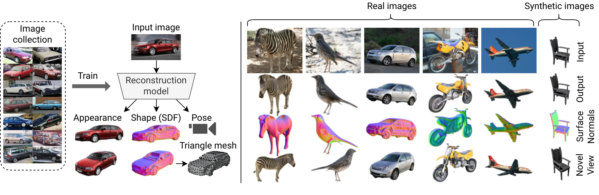

# Shape, Pose, and Appearance from a Single Image via Bootstrapped Radiance Field Inversion
*This is not an officially supported Google product.*

This repository contains the code for the paper
> Dario Pavllo, David Joseph Tan, Marie-Julie Rakotosaona, Federico Tombari. [Shape, Pose, and Appearance from a Single Image via Bootstrapped Radiance Field Inversion](https://arxiv.org/abs/2211.11674). In IEEE/CVF Conference on Computer Vision and Pattern Recognition (CVPR), 2023.

Our approach recovers an SDF-parameterized 3D shape, pose, and appearance from a single image of an object, without exploiting multiple views during training. More specifically, we leverage an unconditional 3D-aware generator, to which we apply a hybrid inversion scheme where a model produces a first guess of the solution which is then refined via optimization.




# Setup
Please follow the instructions in [SETUP.md](SETUP.md).

# Demo
After setting up the pretrained models, you can quickly visualize some results by specifying `--inv_export_demo_sample`, e.g.
```
python run.py --resume_from g_p3d_car_pretrained --inv_export_demo_sample --gpus 4 --batch_size 16
python run.py --resume_from g_cub_pretrained --inv_export_demo_sample --gpus 4 --batch_size 16
python run.py --resume_from g_shapenet_chairs_pretrained --inv_export_demo_sample --gpus 4 --batch_size 16
```
This will run the inversion procedure on a random batch from the test set, and save the resulting images to `outputs/`. You can vary the number of GPUs using `--gpus` (default: 4) and the total batch size using `--batch_size` (default: 32).

# Inference on a custom image
You can try out the model on a custom image by specifying `--inv_manual_input_path <URL or path>`. Internally, it uses detectron2 (which you need to install) to extract the segmentation mask from the image. For an example on CUB birds, try out the following:
```
python run.py --resume_from g_cub_pretrained --inv_manual_input_path https://upload.wikimedia.org/wikipedia/commons/a/a7/Pyrrhula_pyrrhula_female_2.jpg
```

You can also increase the number of inversion steps through `--inv_steps` (from the default 30).

# Evaluation
You can evaluate the reconstruction process quantitatively using the `--run_inversion` flag, e.g.
```
python run.py --resume_from g_p3d_car_pretrained --run_inversion
python run.py --resume_from g_cub_pretrained --run_inversion
python run.py --resume_from g_shapenet_chairs_pretrained --run_inversion
```
This command will first look for a pre-trained encoder, which we provide for all the datasets used in this work (if it is missing, it will train one from scratch). Afterwards, it will invert the full test set (if available) and produce a report with the metrics shown in the paper. As before, you can vary the batch size and number of GPUs using `--batch_size` and `--gpus`, which will not affect the results. You can also compute results in feed-forward mode by specifying `--inv_encoder_only`, which produces the numbers labeled as N=0 in the paper. For `p3d_car`, you can evaluate on our custom ImageNet test set by specifying `--inv_use_imagenet_testset` (otherwise, the official test set is used).

# Training
The unconditional generator can be trained as follows:
```
python run.py --dataset DATASET --path_length_regularization --gpus 4 --batch_size 32
```
where `DATASET` is any of `shapenet_cars`, `shapenet_chairs`, `carla`, `p3d_car`, `cub`, `imagenet_*` (see available ImageNet classes in [SETUP.md](SETUP.md)). TensorBoard logs are exported to `gan_logs/`. The results in the paper were produced using a total batch size of 32, which requires either 4 GPUs with 40GB of memory each (e.g. A100) or 8 GPUs with at least 24 GB each.

Afterwards, the hybrid inversion procedure can be launched via:
```
python run.py --resume_from EXPERIMENT_NAME --run_inversion
```
where `EXPERIMENT_NAME` is the name of the experiment produced by the previous step (you can also find it in `gan_checkpoints/`). This will first train the encoder, save it to `coords_checkpoints/`, and finally launch the actual inversion procedure (whose outputs and TensorBoard logs are exported to `reports/`). Once trained, the encoder will be cached and reused in subsequent calls.

The full list of arguments can be found in [arguments.py](arguments.py)

# Citation
If you use this work in your research, consider citing our paper:
```
@inproceedings{pavllo2023shape,
  title={Shape, Pose, and Appearance from a Single Image via Bootstrapped Radiance Field Inversion},
  author={Pavllo, Dario and Tan, David Joseph and Rakotosaona, Marie-Julie and Tombari, Federico},
  booktitle={IEEE/CVF Conference on Computer Vision and Pattern Recognition (CVPR)},
  year={2023}
}
```


# License
This code is licensed under the Apache 2.0 License. See [LICENSE](LICENSE) for more details.